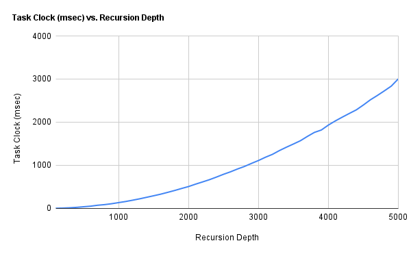
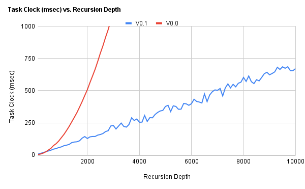
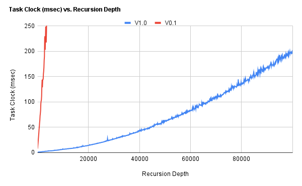
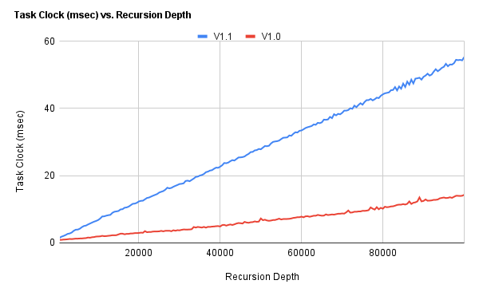

<script type="text/javascript" id="MathJax-script" async src="https://cdn.jsdelivr.net/npm/mathjax@3/es5/tex-mml-chtml.js"></script>

<script>window.MathJax = { tex: { inlineMath: [['$', '$'], ['\\(', '\\)']] } };</script>

# Starting Out

The current assignment involves the creation of a (simple, so far) depth-limited grammar fuzzer that can be called reasonably performant. This task might be divided into two equally important sub-tasks:

1. Developing a performant grammar data structure.
2. Developing a performant fuzzer function, preferably grammar structure-agnostic.

I have two things to go off at present:

1. Although it's probably much easier to write a recursive fuzzer at this stage, I want to start out iterative - common wisdom and for performance reasons down the line.
2. I'll want to implement a depth-limiting mechanism, ie. `min_depth` and `max_depth` parameters. Again, easier to implement in a recursive variant, but I believe I've an idea.

# Initial Implementation `[V0.0]`

I've created the base for what what will become the fuzzer in coming iterations <sup>[[gist](https://gist.github.com/Positron11/86c9c0c98d16ad1f35019a4bd3582ef5/4e13563e1152122d79fb98dabe5e8f8cb611d8f3)]</sup>. At this point, the code is fully "functional", but that's generous. Rather heavy use of pointers doesn't seem quite right, given how convoluted some function definitions, return types in particular, have become (what even is `char *(*getopt(struct g_entry grammar[], char key[]))[]`). Performance is abysmal - the program outright crashes the IDE at a minimum recursion depth of 20.

## The Grammar

```
struct g_entry grammar[GRAMSIZE] = 
{ 
	(struct g_entry { .key=STARTKEY, .rcrsv=0, .optcnt=1, .options={ 
		{ "~phn" } 
	} },
	(struct g_entry) { .key="~phn", .rcrsv=0, .optcnt=2, .options={ 
		{ "~arc", " ", "~@num", "-", "~@num" }, 
		{ "~@num", "-", "~@num" } 
	} },
	(struct g_entry) { .key="~arc", .rcrsv=0, .optcnt=1, .options={ 
		{ "(+", "~dgt", "~dgt", ")" } 
	} },
	(struct g_entry) { .key="~@num", .rcrsv=1, .optcnt=2, .options={ 
		{ "~dgt" }, { "~@num", "~dgt" } 
	} },
	(struct g_entry) { .key="~dgt", .rcrsv=0, .optcnt=10, .options={ 
		{ "0" }, { "1" }, { "2" }, { "3" }, { "4" }, 
		{ "5" }, { "6" }, { "7" }, { "8" }, { "9" } 
	} }
};
```

The grammar is defined as seen above. A `g_entry` grammar entry structure with a key, some members to hold meta information, and an options array, which contains options - arrays of tokens represented by strings (retrospective: breaking a string into substrings consisting of single characters is an... interesting approach - It's striking how close to yet how so far I was from the final grammar structure). 

## The Fuzzer

The fuzzer algorithm, at least how it plays out in my head is now described. The way it's actually implemented in the code at the moment is too convoluted to go into here - the reader is free to expose themselves to the source at their own leisure.

### Expansion Algorithm

1. The fuzzer declares an expansion stack (initialized to the `start` token), a buffer (which just contains everything in the expansion stack except the first token), and an output store. 
2. The fuzzer evaluates the first token in the stack.
3. i. If the token is terminal, it is written to the output store and the stack is overwritten with the buffer.
   ii. Otherwise if the token is nonterminal, a random expansion with the appropriate cost is found and overwritten onto the stack, which is then appended by the buffer
4. This repeats until the expansion stack is empty.

### Depth Limiting Mechanism

Depth limiting is done by the use of a simple `depthlock` token - when a recursive token is encountered, a `depthlock` token is appended to the recursive token's expansion before the buffer is fnally tacked on (step 3i above). A depth counter is then incremented each iteration and checked against limits until the previously inserted `depthlock` is again encountered, at which point all recursion limit variables are reset.

### Expansion Method Analysis

I've rather diverged from my reference [^ifuzrf] in the expansion/parsing method. The reference presents a simple fuzzer and its shortcomings:

1. Searches the string for tokens every iteration (inefficient as production string grows)
2. No control over recursion depth

and then goes on to present an algorithm that explicitly constructs a derivation tree in the fuzzing process, and then converts the tree to an output string.

However, I believe my approach combats the shortcomings identified while also being able to work directly on the production string (expansion stack). Although it seems linear at first glance, a visual abstraction will show that my algorithm is analogous to a depth-first pre-order tree traversal implementation.

A _very_ cursory time complexity analysis of the expansion algorithm itself puts the big-O time complexity at:

$$\lt \text{O}\left(\frac{k^{h + 1} - 1}{n - 1}\right)$$

Where $k$ is the largest expansion (most number of nonterminals, assumed recursive) and $n$ is the `max_depth`. This is almost always likely an overestimation.

## Performance (Retrospective)

Maximum performant depth [^prfmdpt]: $\approx 10^3$.

I was yet to begin profiling anything at this point, but graphing task-clock against recursion depth produced the following:



## To Do Items

A to-do item identified, albeit probably a "late future" one, is implementing support for grammar options - recursion limits for individual rules and expansion probabilities being among the more significant.

# Slight Improvements `[V0.1]`

Being well aware of the complete inadequacy of the previous fuzzer, I've decided to make a few changes <sup>[[gist](https://gist.github.com/Positron11/86c9c0c98d16ad1f35019a4bd3582ef5/a42cefcbf8f52b06bbd35cb3e8937f3d1e519ada)]</sup>. Note that somewhere among these changes is something that causes the printed output of the program to go completely haywire - sometimes. 

## ... To the Grammar

The way tokens are stored (single tokens aggregated into a string array) seems exceedingly wasteful, as well as difficult to read and maintain. The major change made here is that expansions are now represented as full strings:

```
&(Rule) { .key="<phone>", .expansions={
	(char *[]) { "<area> <number>-<number>", "<number>-<number>", NULL }
} },

// [...]

&(Rule) { .key="<number>", .expansions={
	(char *[]) { "<digit>", NULL }, 
	(char *[]) { "<digit><number>", NULL }
} },
```

The tokens are now represented in the BNF format, and `.expansions` is comprised of two sub-arrays of expansions, where the first sub-array contains only cheap (non-recursive expansions) and the second contains only costly (recursive) expansions.

## ... To the Fuzzer

The fuzzer is a lot cleaner as a result of builtin string functions, and also now first sets the desired expansion cost before retrieving a random expansion, instead of poking around until it happens to find a recursive expansion, as it did previously.

## Performance (Retrospective)

Maximum performant depth: $\approx 10^4$.

Again, being yet to begin profiling anything at this point, graphing task-clock against recursion depth, with `V0.0` included for reference produced the following:



# A Somewhat Solid Base `[V1.0]`

This iteration is mostly improvements to the code and minor optimizations, in addition to one major change to the grammar structure <sup>[[gist](https://gist.github.com/Positron11/86c9c0c98d16ad1f35019a4bd3582ef5/9a55a09f2cf21b3b564cec1bf93c039772fd61a5)]</sup>. 

The primary improvement is with regard to the grammar lookup Given I've got keys stored as strings, manually scanning the array doesn't seem the most efficient way of doing this. I've attempted to fix this using a hashtable for the grammar structure, which I did with [uthash](https://troydhanson.github.io/uthash/).

Data is now statically allocated where possible so as to keep it mostly on the stack (ie. as opposed to the heap), variables are `const` qualified and `unsigned` where possible to assist the compiler in optimization, an `enum` replaces the depth lock macros, and token search uses the built-in `strcspn` instead of the slower custom `get_token` function.

I've also cut down the number of secondary functions from 8 to 2 and one function-like macro, inlining functionality where possible, and my string operations are a great deal more reliable. The pointer-walking of arrays and relying on null pointers to demarcate string and array iterations are also entirely gone.

## Performance (Retrospective)

Maximum performant depth: $\approx 10^5$.

For the last time, being yet to begin profiling anything at this point, graphing task-clock against recursion depth, with `V0.1` included for reference produced the following:



# Initial Profiling

Cursory profiling [^profmtd] to the extent I'm able to comprehend the results of which showed that the majority of execution overhead came from string functions (`strcat` in particular) <sup>[[logfile](logfiles/v1.0.data)]</sup>, which suggests either a change to the grammar or the concatenation function.

## Optimizing `strcat`

A brief inquiry into how `strcat` works brought up _Schlemiel the Painter's Algorithm_, and I decided to implement a custom concatenation function using pointers to keep state, that would pass only once over the length of the source array <sup>[commit: [c390831](https://github.com/Positron11/fuzzer/commit/c390831b9e10fb5ee50d4d2bf2fe5e6c81f500f0)]</sup> :

```
char* append(char* dest, char const* src) {
     while (*dest) dest++;
     while (*dest++ = *src++);
     return --dest;
}
```

The resulting improvements were again significant:



by my own criteria, I _could_ state a maximum performant depth of $\approx 10^6$, but it doesn't feel fast enough at that depth to justify it.

[^ifuzrf]: https://www.fuzzingbook.org/html/GrammarFuzzer.html

[^profmtd]: All profiling unless otherwise specified was carried out using `perf stat` and `perf record`.

[^prfmdpt]: Subjective value, basically the order of $10$ at which $\text{execution time} \lt 1\text{s}$